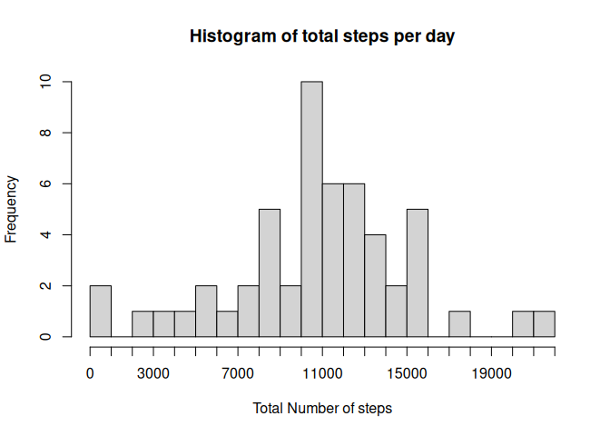
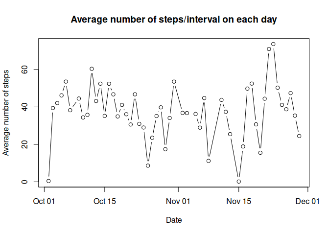
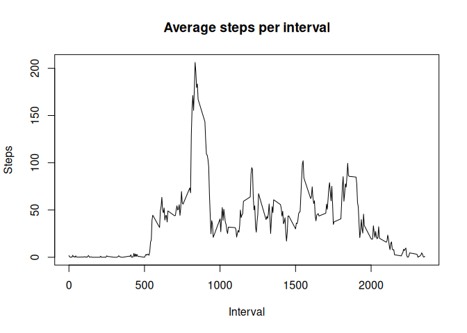
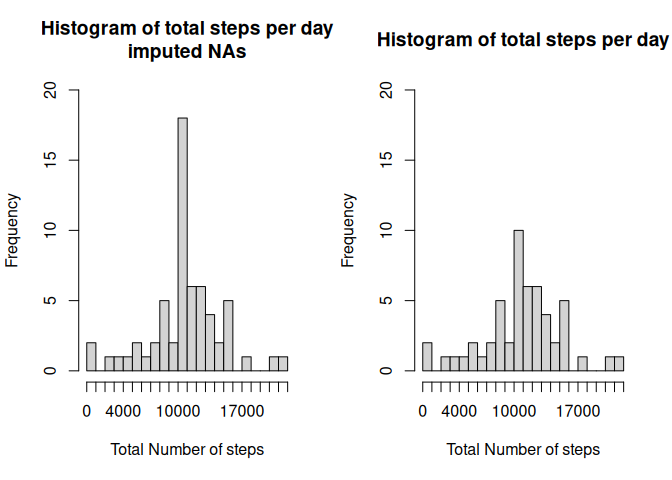
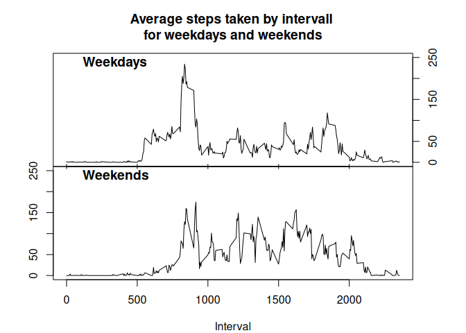

## Loading and preprocessing the data

First we download the files if necessary and load the dataset into the data.frame activity


``` r
if(!file.exists("activity.zip")){
	URL<-"https://d396qusza40orc.cloudfront.net/repdata%2Fdata%2Factivity.zip"
	download.file(URL, destfile = "activity.zip")
	unzip("activity.zip")
}
activity <- read.csv("~/RProgramming/Reproducable Research/RepData_PeerAssessment1/activity.csv")
head(activity)
```

```
##   steps       date interval
## 1    NA 2012-10-01        0
## 2    NA 2012-10-01        5
## 3    NA 2012-10-01       10
## 4    NA 2012-10-01       15
## 5    NA 2012-10-01       20
## 6    NA 2012-10-01       25
```

## What is mean total number of steps taken per day?
To get a feeling for the distribution inside the dataset we plot a histogram for the sum of steps per day.

``` r
activity_sum<-aggregate(steps ~ date, activity, FUN = sum)
hist(activity_sum$steps, breaks = 20,
     xlab = "Total Number of steps",
     main = "Histogram of total steps per day",
     xaxt = "n")
axis(1, at= c(seq(0, 22000, by = 1000)),
     gap.axis = 2.7)
```

<!-- -->

What are the means and medians for the data?

``` r
activity_mean<-aggregate(steps ~ date, activity, FUN = mean); summary(activity_mean)
```

```
##      date               steps        
##  Length:53          Min.   : 0.1424  
##  Class :character   1st Qu.:30.6979  
##  Mode  :character   Median :37.3785  
##                     Mean   :37.3826  
##                     3rd Qu.:46.1597  
##                     Max.   :73.5903
```

``` r
activity_median<-aggregate(steps ~ date, activity, FUN = median); summary(activity_median)
```

```
##      date               steps  
##  Length:53          Min.   :0  
##  Class :character   1st Qu.:0  
##  Mode  :character   Median :0  
##                     Mean   :0  
##                     3rd Qu.:0  
##                     Max.   :0
```
We can see that the median for each day is 0.
This means more than half of the time intervals of each day have 0 measured steps.

## What is the average daily activity pattern?
Let's take a look at the data on a time plot.

``` r
plot(activity_mean$steps ~ as.POSIXct(activity_mean$date, format = "%Y-%m-%d"),
     type = "b",
     ylab = "Average number of steps",
     xlab = "Date",
     main = "Average number of steps/interval on each day")
```

<!-- -->
## Average steps per interval
So what is the interval with the highest average steps taken?

``` r
activity_interval<-aggregate(steps ~ interval, activity, FUN = mean)
plot(activity_interval$steps ~ activity_interval$interval,
     type = "l",
     xlab = "Interval",
     ylab = "Steps",
     main = "Average steps per interval")
```

<!-- -->

``` r
max_interval<- activity_interval[which.max(activity_interval$steps), ]
print(max_interval$interval)
```

```
## [1] 835
```

## Imputing missing values
First let's see how many missing values the dataset has.

``` r
nai<-sum(is.na(activity$steps))
```
That is ```{r} nai``` missing values!

Let us replace each missing value with the mean of the corresponding interval.

``` r
activity_nona <- activity
naindx <- which(is.na(activity_nona$steps))
for(i in naindx){
	activity_nona$steps[i] <- activity_interval[which(activity_interval$interval == activity_nona$interval[i]), "steps"]
}
```

How does this impact the histogram for the data?


``` r
activity_nonasum<-aggregate(steps ~ date, activity_nona, FUN = sum)
par(mfrow=c(1,2))
hist(activity_nonasum$steps, breaks = 20,
     xlab = "Total Number of steps",
     main = "Histogram of total steps per day\nimputed NAs",
     xaxt = "n",
     ylim = c(0,20))
axis(1, at= c(seq(0, 22000, by = 1000)))
hist(activity_sum$steps, breaks = 20,
     xlab = "Total Number of steps",
     main = "Histogram of total steps per day",
     xaxt = "n",
     ylim = c(0,20))
axis(1, at= c(seq(0, 22000, by = 1000)))
```

<!-- -->


We can see that we gained a few days of data that were missing before replacing the missing data. All of them fall into the same region on the histogram, that had the highest frequency before our imputing. This might hint towards whole days missing their data as the all get the same number of steps assigned to them by our imputing method.

## Are there differences in activity patterns between weekdays and weekends?

To see if there is any difference between workdays and weekends, we add another factor to the dataset calculated from the date provided.


``` r
activity$weekday <- ifelse(weekdays(as.POSIXct(activity$date)) == "Saturday" | 
			   weekdays(as.POSIXct(activity$date)) == "Sunday",
			   "weekend", "weekday")
activity$weekday <- as.factor(activity$weekday)

activity_weekday<-aggregate(steps ~ interval + weekday, activity, FUN = mean)
weekday<-activity_weekday[which(activity_weekday$weekday == "weekday"),]
weekend<-activity_weekday[which(activity_weekday$weekday == "weekend"),]
```

We then visualise this data in two time plots

``` r
par(mfrow=c(2,1))
par(mar = c(0, 4, 4, 4))
plot(weekday$steps ~ weekday$interval, type = "l",
     xaxt = "n", yaxt = "n",
     ylim = c(0,250),
     ylab = "")
title(main = "Average steps taken by intervall \nfor weekdays and weekends")
title(main = "Weekdays", line = -1, adj = 0.1)
axis(4, at = seq(0,250, by=50))
axis(1, labels = FALSE, tck = 0.02)
axis(1, labels = FALSE, tck = -0.02)
par(mar = c(4, 4, 0, 4))
plot(weekend$steps ~ weekend$interval, type = "l",
     ylim = c(0,250),
     xlab = "Interval",
     ylab = "")
title(main = "Weekends", line = -1, adj = 0.1)
```

<!-- -->

